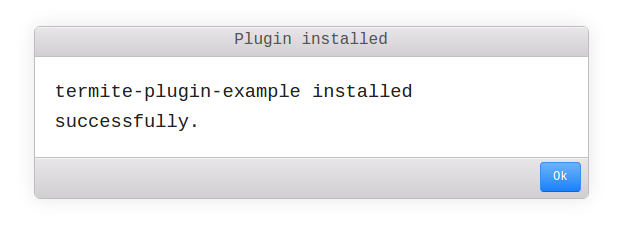
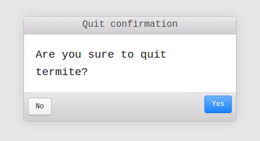

# nice-dialogs

Awesome replace for alert, confirm & prompt js commands.

> This is built with [Electron](https://github.com/atom/electron) usage in mind, but should flawlessy work
> on any modern browser that support the [dialog](https://developer.mozilla.org/en-US/docs/Web/HTML/Element/dialog) element. The module is tested
> only on Electron. Open an issue if you find bugs on some other browser engine.

> Templates use CSS classes from [Photon](https://github.com/connors/photon).
> However, Photon css file are not included, so you can style it whatever you whant.

> We provide only the commonjs module. If you want to use it in a browser, you can use [browserify](https://github.com/substack/node-browserify) to bundle it with your code. Be sure to include [brfs](https://www.npmjs.com/package/brfs) transform, because assets are read using `fs.readFileSync` and you want to include their content in your bundle.

[](http://travis-ci.org/parro-it/nice-dialogs)
[](https://npmjs.org/package/nice-dialogs)
[](https://npmjs.org/package/nice-dialogs)




> Example of dialogs when styled using [Photon](https://github.com/connors/photon)

## Installation

```bash
npm install --save nice-dialogs
```

## Usage

```javascript
  const dialogs = require('nice-dialogs');
  dialogs.confirm('Are you sure?', 'title')
    .then(result => console.log(result))  // true/false

  dialogs.alert('Something happened!', 'Title')
    .then(result => console.log(result))  // always true
```


## License

MIT License.

Copyright (c) 2015 Andrea Parodi
